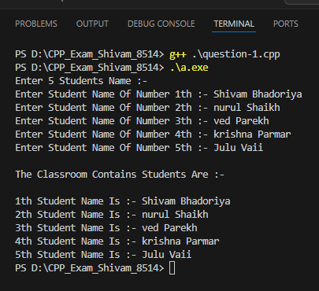

# CPP_Exam_Shivam_8514

# C++ Exam Project

This project contains solutions to 5 object-oriented programming questions commonly asked in C++ exams. The code demonstrates concepts such as inheritance, vectors, arrays, and class structures.

---

## 📘 Table of Contents

- [Overview](#overview)
- [Question 1: Single Inheritance with Student Class](#question-1)
- 
- [Question 2: Multilevel Inheritance](#question-2)
- 
- [Question 3: Vector with Product Class](#question-3)
- 
- [Question 4: Hierarchical Inheritance with Shape Class](#question-4)
- 
- [Question 5: Menu-Driven Vector Program](#question-5)
  
- 
