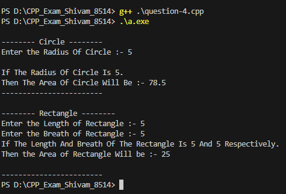
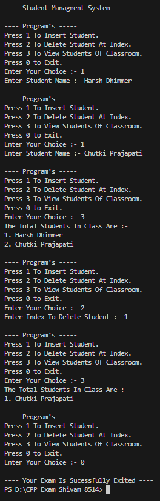

# CPP_Exam_Shivam_8514

# C++ Exam Project

This project contains solutions to 5 object-oriented programming questions commonly asked in C++ exams. The code demonstrates concepts such as inheritance, vectors, arrays, and class structures.

---

## 📘 Table of Contents

- [Overview](#overview)
- [Question 1: Single Inheritance with Student Class](#question-1) 
- [Question 2: Multilevel Inheritance](#question-2) ![alt text] (image-1.png)
- [Question 3: Vector with Product Class](#question-3) ![alt text] (image-2.png)
- [Question 4: Hierarchical Inheritance with Shape Class](#question-4) 
- [Question 5: Menu-Driven Vector Program](#question-5) 
